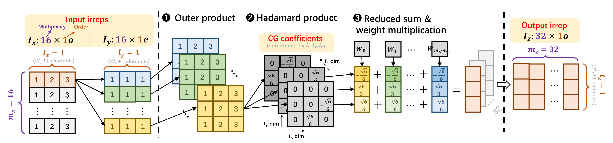
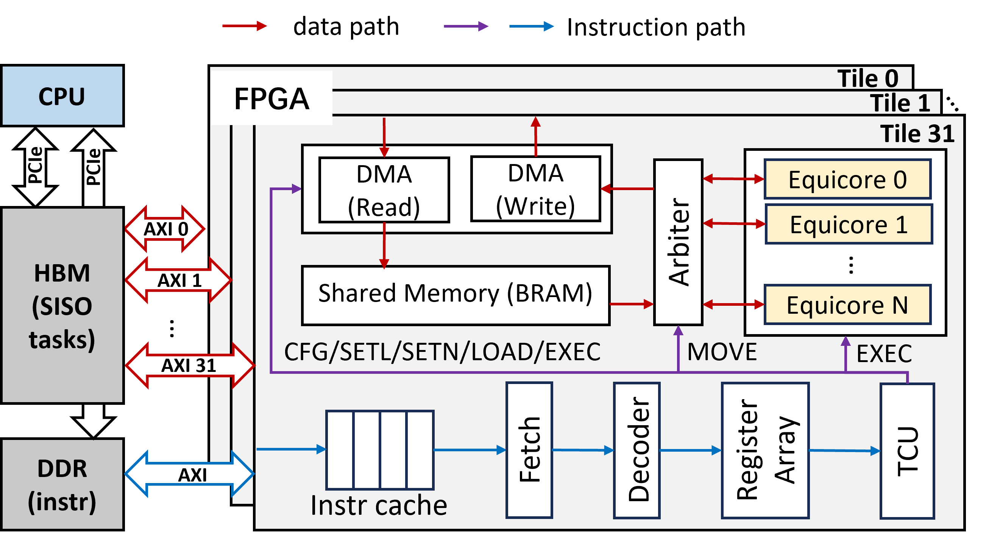
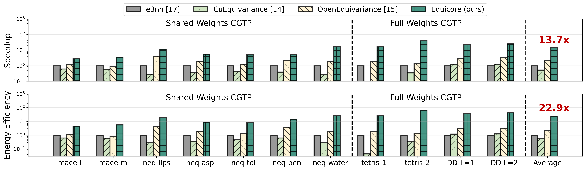

# TP2U: Accelerating Equivariant Neural Networks with Tensor Product Processing Unit on FPGA

[](https://opensource.org/licenses/Apache-2.0)
[](https://www.xilinx.com/products/boards-and-kits/vcu128.html)

**TP²U** is a software-hardware co-design framework developed to accelerate the Clebsch-Gordan tensor product (CGTP)[cite: 26, 224]. CGTP is the primary computational bottleneck in Equivariant Neural Networks (ENNs), which are widely used for modeling 3D geometric data in physical and biological systems [cite: 23-24, 72].

---

## 📸 Algorithm & Architecture Overview

<p align="center">
  
</p>
<p align="center">
  <em>Figure 1: Shows the interaction between input irreps, CG coefficients, and learned weights through outer product, Hadamard product, and reduced sum operations <sup>[cite: 172]</sup>.</em>
</p>

### Key Innovations
* **Sparse-Bypass Strategy (SBS):** Exploits the inherent structural sparsity of CG coefficients (>80%)[cite: 27, 581]. It uses a novel CG data format to pack overlapping non-zeros, bypassing redundant data accesses and computations[cite: 28, 746].
* **Merged-Shift Quantization (MSQ):** Enables full Int8 representation for irreps, weights, and CG coefficients[cite: 29, 229]. It replaces complex operations with hardware-friendly, shift-only dequantization [cite: 29-30, 953].
* **Equicore Unit:** A cascaded processing unit that tightly couples FPGA logic with RAM and DSP resources[cite: 30, 231]. It simplifies logic data paths to achieve a high operating frequency of **500 MHz**[cite: 232, 1131].

---

## 🏗️ Hardware Architecture

The $TP^{2}U$ system consists of a host CPU, high-bandwidth memory (HBM), and the FPGA hardware accelerator[cite: 1001].

<p align="center">
  
</p>
<p align="center">
  <em>Figure 9: Illustrates the interaction between the CPU, HBM, instruction cache, and the parallel Equicore tiles</sup>.</em>
</p>

### Resource Utilization (AMD Virtex VCU128)
As reported after synthesis and implementation in Vivado 2024.1[cite: 1546]:

| Resource | Used | Available | Utilization |
| :--- | :--- | :--- | :--- |
| **BRAM** | 1,796.0 | 2,016 | 89.1%  |
| **DSP** | 3,840 | 9,024 | 42.55%  |
| **URAM** | 384.0 | 960 | 40.0%  |
| **LUT** | 183,306 | 1,303,680 | 14.1%  |

---

## 🚀 Software Compilation & ISA

The host CPU partitions MIMO tasks into independent SISO tasks [cite: 1002, 1252] and generates 32-bit customized instructions to orchestrate the hardware[cite: 1447].

> **[Insert Figure 13: Customized instructions for executing CGTP operations]** > *(Description: Details the ISA including CFG, SETL, SETN, LOAD, MOVE, EXEC, and HALT instructions [cite: 1446-1451].)*

### Workflow
1. **Offline Quantization:** The host performs MSQ on irreps, weights, and CG coefficients[cite: 1251].
2. **Instruction Generation:** The compiler generates a specific instruction stream for each SISO task[cite: 1447].
3. **Deployment:** Instructions are loaded into the FPGA DDR, and data is transferred to HBM via PCIe [cite: 1003-1004].

---

## 📊 Experimental Results

### Performance & Efficiency
Compared to state-of-the-art GPU libraries (e3nn, OpenEquivariance), $TP^{2}U$ delivers:
* **Speedup:** Up to **10.5x** over e3nn and **5.3x** over OpenEquivariance[cite: 31, 1591].
* **Energy Efficiency:** Up to **17.4x** improvement over e3nn[cite: 31, 1593].

<p align="center">
  
</p>
<p align="center">
  <em>Figure 15: Speedup and energy efficiency comparison of Equicore with GPU-based works</sup>.</em>
</p>

### Accuracy Evaluation (Aspirin Dataset)
| Method | Force MAE (meV/Å) | Energy MAE (meV) | Hardware Friendly |
| :--- | :--- | :--- | :--- |
| Full Precision (fp32) | 0.038 | 0.274 | Low  |
| **TP²U (Ours - Int8)** | **0.309** | **9.18** | **High**  |
*(Note: While absolute error increases, the relative energy error remains extremely small (<<1%).)*

---

## 📄 License

This project is licensed under the **Apache License 2.0**. See the [LICENSE](LICENSE) file for details.

## ✍️ Citation

If you use this work in your research, please cite our paper:

```bibtex
@article{tang2026tp2u,
  title={TP2U: Accelerating Equivariant Neural Networks with Tensor Product Processing Unit on FPGA},
  author={Tang, Shidi and Zhang, Chuanzhao and Chen, Ruiqi and Lv, Yuxuan and Silva, Bruno da and Ling, Ming},
  journal={IEEE},
  year={2026}
}