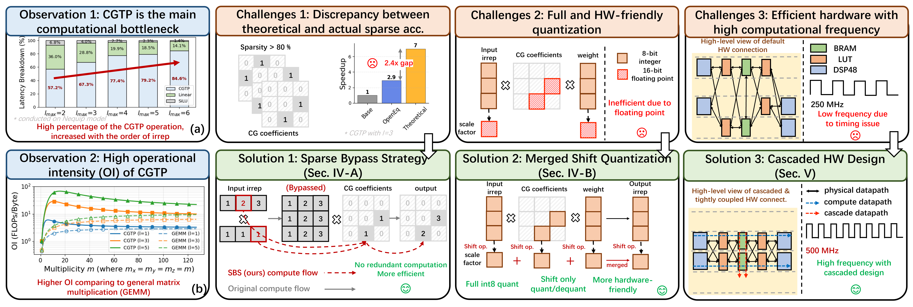
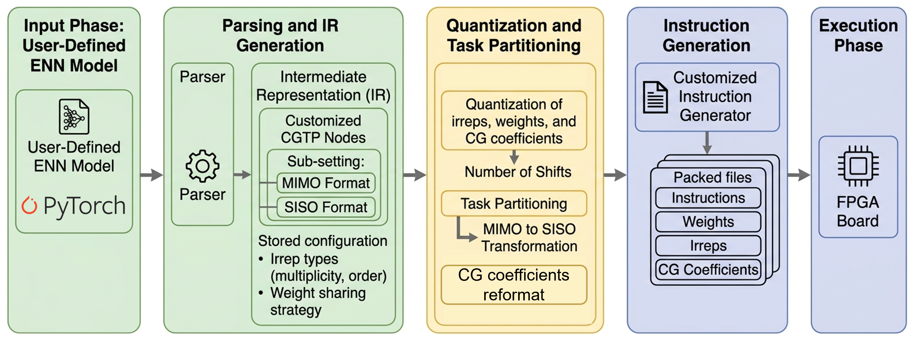

# TP2U: Accelerating Equivariant Neural Networks with Tensor Product Processing Unit on FPGA

[](https://opensource.org/licenses/Apache-2.0)
[](https://www.xilinx.com/products/boards-and-kits/vcu128.html)

**TP²U** is a software-hardware co-design framework developed to accelerate the Clebsch-Gordan tensor product (CGTP)]. CGTP is the primary computational bottleneck in Equivariant Neural Networks (ENNs), which are widely used for modeling 3D geometric data in physical and biological systems.

---

## 📸 Algorithm & Architecture Overview

<p align="center">
  
</p>
<p align="center">
  <em>Challenges and solutions for accelerating ENNs on FPGA <sup></sup>.</em>
</p>

### Key Innovations
* **Sparse-Bypass Strategy (SBS):** Exploits the inherent structural sparsity of CG coefficients (>80%). It uses a novel CG data format to pack overlapping non-zeros, bypassing redundant data accesses and computations.
* **Merged-Shift Quantization (MSQ):** Enables full Int8 representation for irreps, weights, and CG coefficients. It replaces complex operations with hardware-friendly, shift-only dequantization.
* **Equicore Unit:** A cascaded processing unit that tightly couples FPGA logic with RAM and DSP resources. It simplifies logic data paths to achieve a high operating frequency of **500 MHz**.

---

## 🏗️ Hardware Architecture

The $TP^{2}U$ system consists of a host CPU, high-bandwidth memory (HBM), and the FPGA hardware accelerator.

<p align="center">
  
</p>
<p align="center">
  <em>Illustration of the interaction between the CPU, HBM, instruction cache, and the parallel Equicore tiles</sup>.</em>
</p>

### Resource Utilization (AMD Virtex VCU128)
As reported after synthesis and implementation in Vivado 2024.1:

| Resource | Used | Available | Utilization |
| :--- | :--- | :--- | :--- |
| **LUT** | 918,138 | 1,303,680 | 70.43% |
| **FF** | 1,043,328 | 2,607,360 | 40.01% |
| **BRAM** | 1,896.0 | 2,016 | 94.05% |
| **URAM** | 864.0 | 960 | 90.0% |
| **DSP** | 5,888 | 9,024 | 65.25% |

---

## 🚀 Software Compilation & ISA

The host CPU partitions MIMO tasks into independent SISO tasks and generates 32-bit customized instructions to orchestrate the hardware.

<p align="center">
  
</p>
<p align="center">
  <em>Illustration of the workflow of our customized software compilation scheme</sup>.</em>
</p>


## 📊 Experimental Results

### Performance & Efficiency

<p align="center">
  
</p>
<p align="center">
  <em>Figure 15: Speedup and energy efficiency comparison of Equicore with GPU-based works</sup>.</em>
</p>

## 📄 License

This project is licensed under the **Apache License 2.0**. See the [LICENSE](LICENSE) file for details.

## ✍️ Citation

If you use this work in your research, please cite our paper:

```bibtex
@article{tang2026tp2u,
  title={TP2U: Accelerating Equivariant Neural Networks with Tensor Product Processing Unit on FPGA},
  author={Tang, Shidi and Zhang, Chuanzhao and Chen, Ruiqi and Lv, Yuxuan and Silva, Bruno da and Ling, Ming},
  journal={IEEE},
  year={2026}
}