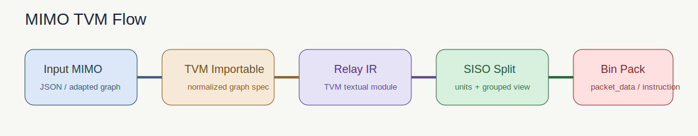

# MIMO TVM Flow

`MIMO TVM Flow` is a lightweight open-source workflow for converting a generic MIMO description into:

1. a TVM-importable JSON format,
2. TVM Relay IR,
3. expanded SISO units,
4. demo `packet_data.bin` and `instruction_stream.bin` artifacts.

The repository is designed for understanding and prototyping the full path from high-level graph construction to IR lowering, SISO decomposition, and binary packing.



## Requirements

- Python 3.8+
- `apache-tvm==0.11.1`
- `numpy`

Optional:

- `torch` for the PyTorch frontend example
- `torch` and `e3nn` for the built-in `--problem-model` catalog

## Installation

Minimal install:

```bash
pip install -e .
```

Install with optional frontends:

```bash
pip install -e ".[problem-model,pytorch]"
```

## Quick Start

### 1. Generic JSON input

```bash
python -m mimo_tvm_flow \
  --input-json examples/sample_generic_mimo.json \
  --output-dir outputs/sample_generic
```

### 2. Built-in problem-model input

```bash
python -m mimo_tvm_flow \
  --problem-model DiffDock-L=1 \
  --batch-size 3000 \
  --output-dir outputs/diffdock_l1
```

Built-in model definitions are included in:

- `src/mimo_tvm_flow/model_catalog.py`
- `examples/builtin_problem_models.json`

### 3. PyTorch frontend example

```bash
python -m mimo_tvm_flow \
  --pytorch-example tiny_dual_input \
  --output-dir outputs/pytorch_demo
```

### 4. Your own PyTorch or e3nn layer

Create a small adapter script that returns a model bundle, then run:

```bash
python -m mimo_tvm_flow \
  --pytorch-script examples/pytorch_e3nn_template.py \
  --pytorch-entry build_model_bundle \
  --output-dir outputs/user_layer
```

Use `examples/pytorch_e3nn_template.py` as the starting point. Replace the demo module with your own `torch.nn.Module` or `e3nn` layer, and keep the returned bundle fields:

- `model`: the PyTorch model to trace with `torch.fx`
- `sample_inputs`: example tensors used to describe input dimensions
- `nodes`: MIMO-level node descriptions that will be converted into `NodeSpec`
- `outputs`: optional output names

## Workflow

The pipeline is:

1. Start from a generic JSON spec, a built-in `problem-model`, or a PyTorch/e3nn module.
2. Normalize the input into a common `GraphSpec`.
3. Lower the graph into TVM Relay IR.
4. Expand each MIMO node into multiple SISO units according to `multiplicity`.
5. Group SISO units by structural signature for analysis.
6. Pack each SISO unit into demo payload bytes and a 7-word instruction sequence.

In the current implementation:

- the PyTorch frontend is defined in `src/mimo_tvm_flow/pytorch_frontend.py`
- SISO splitting is implemented in `src/mimo_tvm_flow/siso.py`
- bin packing is implemented in `src/mimo_tvm_flow/packing.py`

## From e3nn PyTorch to SISO and bin

If your layer is written in PyTorch with `e3nn`, the expected usage is:

1. Wrap the layer in a small Python file that exposes `build_model_bundle()`.
2. Return your model plus a lightweight node description with:
   `connection_mode`, `x1_dim`, `x2_dim`, `out_dim`, `weight_dim`, and `multiplicity`.
3. Run `mimo_tvm_flow` with `--pytorch-script`.
4. Inspect:
   - `00_pytorch_fx_graph.txt` / `.svg` for the traced frontend graph
   - `04_siso_units.json` for expanded SISO units
   - `05_pack_summary.json` for payload and instruction-stream statistics

Today, the tool does not automatically infer all e3nn tensor-product semantics from an arbitrary model. The recommended pattern is to provide the structural node metadata explicitly in the bundle, then let the pipeline handle IR export, SISO expansion, and bin generation.

## Main Outputs

Each run generates staged artifacts under the chosen output directory, including:

- input graph JSON and SVG
- TVM-importable JSON
- Relay IR text
- SISO units and grouped signatures
- demo `packet_data.bin`
- demo `instruction_stream.bin`
- a final Markdown report

## Notes

- This project is a workflow skeleton, not a production TVM backend.
- The demo bin format is illustrative and does not claim compatibility with any specific FPGA runtime.
- The built-in `--problem-model` path is meant for structure-level adaptation and experimentation.
